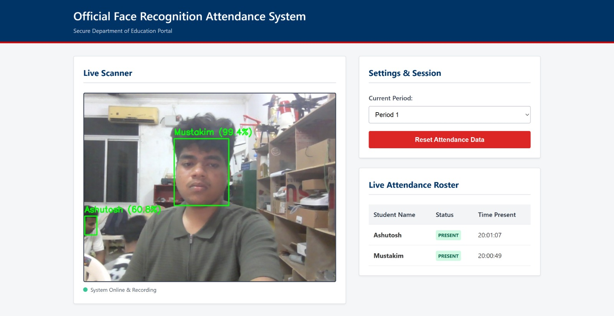
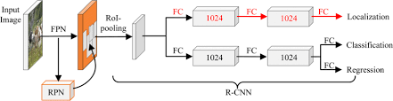

# 🎓 Face Recognition Based Attendance System

> An end-to-end AI-powered attendance system using **MTCNN + FaceNet + SVM**, with an optional **Faster R-CNN** detection backbone and **MobileNet** classifier, served via a Flask web application.

---

## 📸 Application UI



---

## 🏗️ Project Architecture


---

## 1. The Big Picture: How the Pipeline Works

Imagine you are a bouncer at an exclusive club. Before you let someone in, you do three things:
1. **Look at the person's face** — Is there a face?
2. **Study their unique facial features** — What are the distances between their eyes, nose, shape of jaw, etc.?
3. **Check your VIP List** — Do these features match a name I know?

Our face recognition AI does exactly this in a 3-step pipeline:
1. **MTCNN (Face Detection):** Scans the image or webcam frame to find where the face is, and crops it out.
2. **FaceNet (Feature Extraction):** Looks at the cropped face and calculates an array of numbers (called an "embedding") that uniquely represent that face's geometry.
3. **SVM Classifier (Prediction):** Looks at those numbers and decides which known person they belong to.

---

## 2. Deep Dive: Architectures

### MTCNN (Multi-task Cascaded Convolutional Networks)
MTCNN is responsible for **finding faces** in raw, messy images. It doesn't know *who* the person is, just *where* the face is. It works in three cascaded stages:
- **P-Net (Proposal Network):** Quickly scans the entire image to find potential face blobs.
- **R-Net (Refine Network):** Filters out false positives and adjusts the bounding boxes.
- **O-Net (Output Network):** Does a final refinement and outputs the highly accurate bounding box.

### FaceNet (InceptionResnetV1)
FaceNet is the heavy-lifting "brain" of the operation. We use a version pre-trained on `vggface2` (a massive dataset of millions of faces).
Instead of directly outputting a name, FaceNet translates an image of a face into a **512-dimensional numerical vector** (an "embedding").
*The magic of FaceNet:* If you feed it two pictures of the *same* person, the distance between their embeddings will be near zero. If you feed it two *different* people, the distance will be large.

### SVM (Support Vector Machine)
Because FaceNet only gives us raw numbers, we need a way to connect those numbers to actual names. The SVM takes all the embeddings generated during training and mathematically draws boundaries between them in 512-dimensional space. When a new face embedding comes in via webcam, the SVM checks which side of the boundary it falls on to predict the name.

### Faster R-CNN (Alternative Detector)



As an alternative detection backbone, we also trained a **Faster R-CNN with ResNet-50 FPN** on the WIDER FACE dataset for robust, high-accuracy face detection.

---

## 3. Training Results & Metrics

### 📉 Training Loss Curves

| FaceNet/SVM Pipeline | Faster R-CNN |
|---|---|
|  |  |

> The WIDER FACE Precision-Recall curve was generated on the validation split to evaluate the Faster R-CNN detector.

---

### 📊 MobileNet Classifier (Experimental Model)

As part of our comparison, we also explored a **MobileNetV2** based classifier. Below are its training metrics and confusion matrix:

| Training Metrics | Confusion Matrix |
|---|---|
|  |  |

---

### 🔍 SVM Classifier — Confusion Matrix


---

## 4. How the Model is Trained

Here is exactly how the training pipeline operates inside `utils/train_gpu.py`.

### Step 1: Detect and Extract the Face (MTCNN)

```python
# Initialize MTCNN to find faces
mtcnn = MTCNN(
    image_size=160,
    margin=20,
    min_face_size=20,
    device=device
)

# Provide an RGB image to MTCNN to extract the cropped face tensor
face = mtcnn(img_rgb)
```

### Step 2: Extract Embeddings (FaceNet)

```python
# Initialize FaceNet
resnet = InceptionResnetV1(pretrained='vggface2').eval().to(device)

# Send the cropped face to the GPU
face = face.unsqueeze(0).to(device)

# Get the embedding (the 512 unique numbers)
with torch.no_grad():
    embedding = resnet(face)

# Save the embedding and the person's name for training later
encodings.append(embedding.cpu().numpy()[0])
labels.append(person_name)
```

### Step 3: Train the SVM Classifier

```python
from sklearn.svm import SVC
import joblib

print("🚀 Training SVM model...")

# Create and train the classifier on the extracted embeddings
model = SVC(kernel='linear', probability=True)
model.fit(encodings, labels)

# Save the trained model to disk
joblib.dump(model, "models/face_model_gpu.pkl")
```

---

## 5. Inference (Real-Time Recognition)

When you run the attendance system, the same pipeline runs in real-time against a live webcam:
1. The **webcam** captures a frame.
2. **MTCNN** detects the face in the live video stream.
3. **FaceNet** computes the live embedding.
4. The trained **SVM Model** predicts the name based on the embedding and draws the bounding box on screen.
5. The attendance record is logged automatically.

---

## 6. Project Structure

```
PDD/
├── app.py                        # Flask web application
├── run_attendance_system.py      # Main entry point
├── utils/                        # Training & utility scripts
├── Face/                         # FaceNet model components
├── scripts/                      # Helper scripts
├── notebooks/                    # Jupyter notebooks
├── static/                       # CSS, JS assets
├── templates/                    # HTML templates
├── UI_results/                   # UI screenshots
├── plots/                        # Training plots & metrics
├── assets/                       # Architecture diagrams
├── requirements_face_gpu.txt     # GPU dependencies
└── requirements_venv.txt         # Full environment dependencies
```

---

## 7. Setup & Installation

```bash
# 1. Clone the repository
git clone git@github.com:Seikh05/Face-Recognition-based-Attendance-System.git
cd Face-Recognition-based-Attendance-System

# 2. Create a virtual environment
conda create -n face_env python=3.9
conda activate face_env

# 3. Install dependencies
pip install -r requirements_face_gpu.txt

# 4. Run the application
python run_attendance_system.py
```

---

## 📄 License

This project is for academic and educational purposes.
